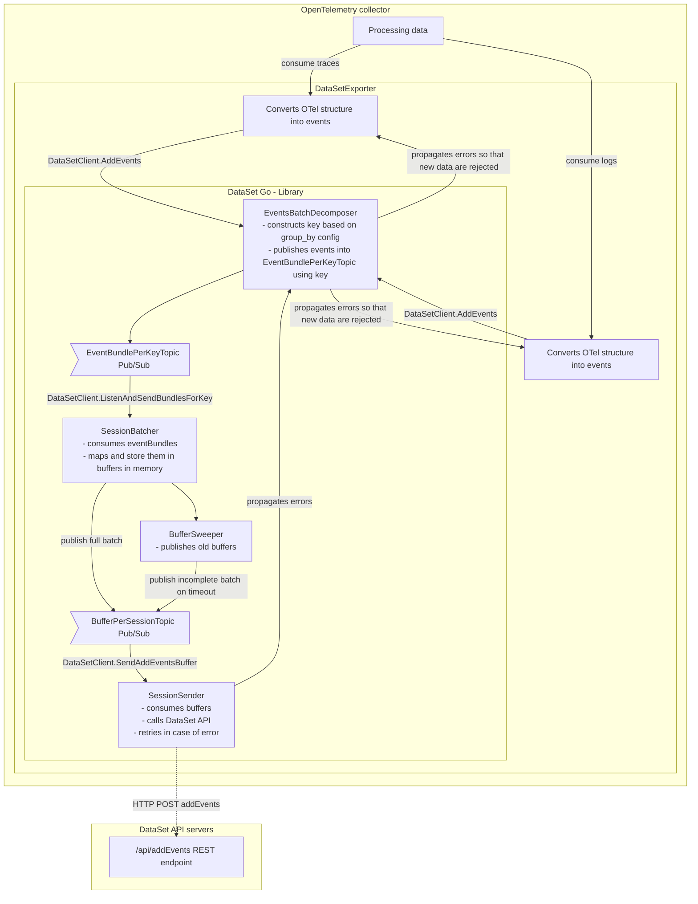

# Architecture

This library is under development, and it's primarily designed to fulfil needs of the
open telemetry exporter and therefore some functionality that would be useful in other
scenarios is not implemented.

## Idea

Design is heavily influenced by peculiarities of the upstream and downstream systems
about which I know very little.

### Downstream

The downstream system is DataSet REST API and its API call [addEvents](https://app.scalyr.com/help/api#addEvents).
It has the following properties:

* `D1` - DataSet does not support parallel requesting per session. Only one request for each session could be made at one time
* `D2` - when a new DataSet version is deployed, there could be a short window of unavailability of a particular queue server when it's being restarted in a rolling manner. During the restart / unavailability, sessions which are mapped to a particular queue server may be temporary unavailable and those requests need to be retried. Per queue server unavailability should not last more than a couple of minutes (in real life it's < 120 seconds)
* `D3` - maximum payload size for the API is 6MB before compression

### Upstream

The upstream system is [open telemetry collector](https://opentelemetry.io/docs/collector/),
where the datasetexporter is one of many exporters that could be used
(on the right side of the image). It has the following properties:

* `U1` - incoming data (logs, traces & metrics) are passed (collector/exporter contract) in batches
* `U2` - each batch could be either accepted or rejected, if it's accepted it cannot be returned, if it's rejected, it may be retried
  * `U2.1` - collector has data persistence (file system) feature in case exporter rejects batch, in order to be able to resend batch later
* `U3` - collector/exporter API function for accepting batches can be called in parallel (with different batches)

### Consequences

As a consequence of the upstream and downstream system following has to happen (codes
between brackets points to the previous points):

* `C1` - incoming batch of EventsBundles has to be divided into multiple sessions, in order to increase throughput (`D1`)
* `C2` - data from multiple input batches should be combined while sending to DataSet, in order to achieve maximum throughput (use maximal batch size) (`D1`, `U1`)
  * `C2.1` - user has to be able to define the grouping mechanism via specifying fields in config.
    * If more fields are specified, keys are constructed using all of them and events distributed to session with more granularity.
* `C3` - input and output (DataSet events) has to be decoupled (`D1`, `C1`, `C2`)
* `C4` - if the downstream returns error, exporter cannot return data that has already accepted, exporter has to handle retries by itself (`U2`, `U3`)
* `C5` - if the downstream returns error, exporter can rely on exporter retry mechanism (`U2.1`) and reject further incoming batches

## Implementation

* `I1` - to decouple upstream from downstream we use pub/sub pattern (`C3`)
* `I2` - there are two levels of pub/sub patterns, in order to optimize DataSet ingestion efficiency (via grouping events based on keys)
  * `I2.1` - publisher 1 - each event from incoming batch is published into EventBundlePerKeyTopic (`I1`, `C2`) using key
    * keys are constructed based on values of user defined fields (`C2.1`). This results into grouping events to sessions based on defined fields.
  * `I2.2` - subscriber 1 / publisher 2 - each session batcher reads individual EventBundles from its own (based on key) EventBundlePerKeyTopic and combines them into batches, batches are published into the corresponding BufferPerSessionTopic (`C2`). Note key defines session (client.id + key)
  * `I2.3` - publisher 2 - output batch is published even if it's not full after some time period
  * `I2.4` - subscriber 2 - each session sender reads individual Buffers (batched events) from the BufferPerSessionTopic and sends them into DataSet API server (`D1`)
* `I3` - each session has its own go routine, which has its own thread (`I2.1`)

### Error Propagation

Error state is shared among all sessions. It works in the following way:

* when error is returned from the API call then:
  * system enters error mode
  * internal retry mechanism is triggered
* when the system is in error mode, then:
  * new incoming batches are rejected so that external retry mechanism is triggered
  * internal retry are still happening
* error state recovery:
  * some of the internal retries succeeds, see (`KI1`)
  * NOT YET IMPLEMENTED: system recovers from error state after predefined (refer to config) timeout - https://sentinelone.atlassian.net/browse/DSET-4080

### Internal Batching

This section describes how internal batching works for data belonging to the single session:

* structure that is used for internal batching is call `Buffer`
* `Buffer` has maximum allowed size (`D3`)
* events are added into the `Buffer` until it's full (`I2.2`)
* if the buffer is not full and is older than `max_lifetime` then it's published as well (`I2.3`)
* if the event is larger than remaining space in current `Buffer`, then the current `Buffer` is published and event is added into the new `Buffer`
* if the event is larger than the maximum allowed size, then attribute values are trimmed - from the longest to the shortest

### Known issues

* `KI1` - Possible memory issues on error state recovery race condition
  * exporter implements rejection mechanism (`C5`) to prevent memory issues
  * exporter may face race condition on lastHttpStatus in following situation
    * Incoming batch events are distributed into SessionA and SessionB
    * SessionA request to DataSet fails -> exporter enter an error mode by setting lastHttpStatus. This prevents accepting further incoming batches.
    * No matter of current lastHttpStatus SessionB sends batch to DataSet and fails as well.
    * Later on SessionA retries sending previously failed batch and succeeds and sets lastHttpStatus. This enables accepting further incoming batches no matter of SessionB retries.
    * Collector can pass events (handled by SessionB) which are stored in memory until SessionB retry succeeds. This may result into memory issues.
