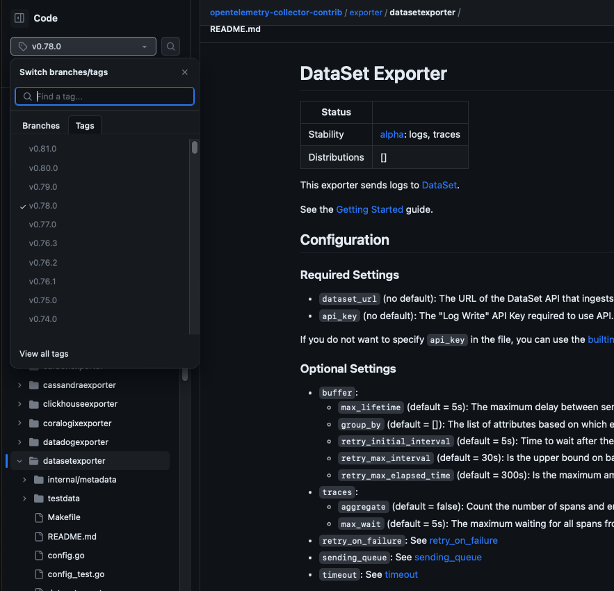

# Error: Failed to get config

## Issue Description

You are encountering error messages while executing OpenTelemetry, which can be one of the following:

1. Invalid keys:
   ```
   Error: failed to get config: cannot unmarshal the configuration: 1 error(s) decoding:

   * error decoding 'exporters': error reading configuration for "dataset": cannot unmarshal config: 1 error(s) decoding:

   * '' has invalid keys: logs
   ```
   * This error indicates that there is a problem decoding the configuration for the `dataset` exporter. It specifically mentions that the configuration has invalid keys, such as `logs`.
2. Unknown exporters:
   ```
   Error: failed to get config: cannot unmarshal the configuration: 1 error(s) decoding:

   * error decoding 'exporters': unknown exporters type: "dataset" for id: "dataset"
   ```
   * This error points out that an unknown exporter type, specifically "dataset," is being used.

## Procedural Steps to Restore the Service

### Invalid Keys

The first error indicates that there is mismatch between the configuration that you are using
and the configuration that the collector understands.

Follow these steps to troubleshoot and resolve the issues:

1. Determine the version of OpenTelemetry Collector you are using by running the command line argument `--version`. For example, the output could be `otelcol-contrib version 0.78.0`.
2. Based on the version obtained, navigate to the corresponding documentation on GitHub by appending the version number to the URL. For instance, for version 0.78.0, the URL would be https://github.com/open-telemetry/opentelemetry-collector-contrib/tree/v0.78.0.
   The documentation is in the [exporters/datasetexporter](https://github.com/open-telemetry/opentelemetry-collector-contrib/tree/v0.78.0/exporter/datasetexporter/README.md).
3. Review the documentation for the `datasetexporter`. In the case of the first error, check if the logs configuration option exists in the documentation.
   By trying different versions, you can see, that configuration option `logs` was introduced in the version [0.80.0](https://github.com/open-telemetry/opentelemetry-collector-contrib/tree/v0.80.0/exporter/datasetexporter/README.md).
4. Ensure that your configuration matches the capabilities of the collector version you are using. Either update your configuration to align with the collector version or use a matching collector version.




## Unknown Exporters

The second error - `unknown exporters type: "dataset"` - indicates that you are using
version that does not contain `datasetexporter` at all. `datasetexporter` was introduced in
the version [v0.77.0](https://github.com/open-telemetry/opentelemetry-collector-contrib/releases/tag/v0.77.0) released on 2023-05-09.

Follow these steps to troubleshoot and resolve the issues:

1. Determine the version of OpenTelemetry Collector you are using by running the command line argument `--version`. For example, the output could be `otelcol-contrib version 0.78.0`.
2. Update your OpenTelemetry Collector to the latest version that includes `datasetexporter`.

## Expected Outcome

Once your configuration aligns with the expectations of the OpenTelemetry Collector, you should observe that the collector starts successfully. In version v0.81.0, you can expect to see the log message: `Everything is ready. Begin running and processing data`.

## Verification Process Step(s)

To verify if the issue is resolved:

1. Execute the OpenTelemetry Collector as before.
2. Check if there are any error messages related to configuration decoding failures.
3. Look for a log message indicating that the collector started successfully.

## Miscellanea

It's possible to encounter similar error messages for different components other than the `datasetexporter`.
You can apply a similar approach to resolve those issues as well.
